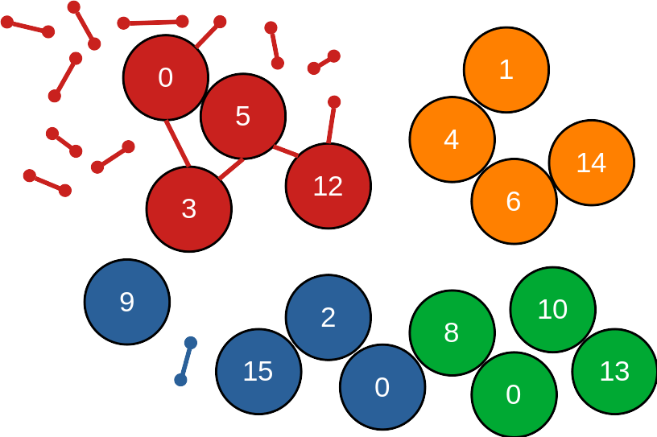
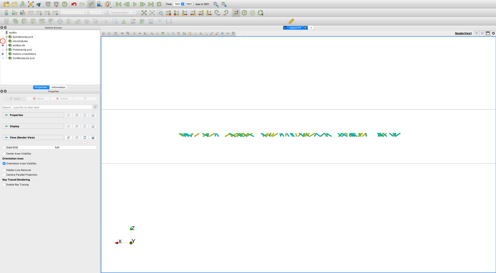

# Day 2: aLENS introduction (part 1) 

https://github.com/flatironinstitute/aLENS

https://lamsoa729-alens.readthedocs.io/en/latest/quickstart.html


## Today's Agenda

| Day 2  (Tuesday 6/6) | aLENS (part 1) |
| --- | --- |
| 2:00PM | Introduction to aLENS (what can it do) <br /> Speaker: Adam |
| 2:30PM | Computational methods and code structure of aLENS  <br /> Speaker: Bryce |
| 3:00PM | Break |
| 3:10PM | Tutorial: Running aLENS for the first time <br /> Instructor: Adam |
| ~3:45PM | Paraview and visualizing|
| ~4:00PM | Break  |
| ~4:10PM | Explanation of parameters and playing with simulations |


# aLENS: What is it good for?


# A peak into the numerical methods behind aLENS

- Domain decomposition/load balancing/neighbor detection
- Particle (rod) mobility
- Spring/collision resolution

## Domain decomposition/load balancing/neighbor detection

aLENS automates many of the essential particle-based simulation tasks for you. 

It automatically performs 
- Domain decomposition to ensure that the number of particles per process remains constant.
- Load balancing to rebalance the particle distribution as the system evolves. 
- Neighbor detection to check for collisions between particles.

Example domain decomposition:


## An important caveat to be aware of

aLENS' Domain decomposition and load balancing ensures that the number of *particles* per process remains constant, not the number of springs. 
  
This can lead to load imbalance and increased communication costs/computation time. 

If we have a large number of springs in our upper left-hand corner, then the red process is now overloaded with work, containing 18 objects, whereas the other processes have 4-5 objects. 


As a result, aLENS performs best when the distribution of springs is similar to the distribution of particles. If you have strong differences between the two, that's fine; it'll just cause some inefficiency. 

## Particle mobility

The mobility problem consists of finding the unconstrained translational and rotational velocities of all particles given the forces and torques that act upon them. We abstractly write this as $V = \mathcal{M}(F)$. 

aLENS was programmed to accept any linear mobility operator. 

## What mobility operators does aLENS support?

aLENS currently only supports "dry" hydrodynamic mobility where each rod's motion is resisted by *local* viscous drag.

Local drag has some caveats:
- Rods and springs are suspended in space unless acted upon by a force (we typically ignore gravity).
- The perpendicular drag coefficient is larger than the parallel coefficient.
  - Can lead to visually unintuitive motion. 

## What mobility operators will aLENS 2.0 support?

- Local drag
- Many-body hydrodynamics (via slender body theory, force dipoles, and boundary integrals)
- Dry inertial (no fluid)

## Spring/collision resolution

Motion, according to the *unconstrained* mobility problem, can cause particles to overlap and springs to violate Hooke's law. 

aLENS addresses this issue by writing the spring force and collision-free conditions as linearized constraints. The unknowns, which we must solve for at each timestep, are thus the collision and spring force magnatudes $\lambda$.
- For springs, the constraint seeks to minimize the difference between $\lambda$ and $k\delta x$.
- For collisions, the constraint seeks to minimize the overlap between particles while ensuring that non-overlapping particles have zero collision force.

Thogether, these constraints form a constrained convex optimization problem, which can be solved via projected tradient descent. 


# Tutorial: Running aLENS for the first time 


## Pre-software installation
- Docker desktop
  - Sign up at docker hub [https://hub.docker.com/](https://hub.docker.com/)
  - Download docker desktop [https://www.docker.com/products/docker-desktop/](https://www.docker.com/products/docker-desktop/)
  - (Optional) Docker engine
    - Linux [https://www.linux.com/topic/desktop/how-install-and-use-docker-linux/](https://www.linux.com/topic/desktop/how-install-and-use-docker-linux/)
    - Mac [https://medium.com/crowdbotics/a-complete-one-by-one-guide-to-install-docker-on-your-mac-os-using-homebrew-e818eb4cfc3](https://medium.com/crowdbotics/a-complete-one-by-one-guide-to-install-docker-on-your-mac-os-using-homebrew-e818eb4cfc3)
- paraview [https://www.paraview.org/download/](https://www.paraview.org/download/)
- hdf5 view
  - Sign up for service [https://www.hdfgroup.org/register/](https://www.hdfgroup.org/register/)
  - Download at [https://www.hdfgroup.org/downloads/hdfview/#download](https://www.hdfgroup.org/downloads/hdfview/#download)


## Creating a container

<!-- 1. Open [docker desktop](https://www.docker.com/blog/getting-started-with-docker-desktop/) -->

<!-- TODO Make overview for dockerhub image -->
1. Pull latest docker image from [dockerhub](https://hub.docker.com/r/lamsoa729/alens)

   ```bash
   docker pull lamsoa729/alens:latest
   ```

1. Make a folder to access your simulation data stored generated in docker container

   ```bash
   mkdir my_alens_data; cd my_alens_data
   ```

1. Create and run a docker container from the image pulled from dockerhub
   ```bash
   docker run --volume=<path/to/my_alens_data>:/root/Run --name alens -dit lamsoa729/alens:latest
   ```
   (see documentation for details of this command)

You now have access to an environment that can run aLENS but will create data files on your local computer.


## Running aLENS inside docker containter

1. To open a CLI with your docker container, you can either use your native terminal or docker desktop's GUI. 
 
    * For native terminal
  
      ```bash
      docker exec -it alens /bin/bash
      ```
    * For docker desktop, click the running `alens` container while in the containers section
      
      
      
    * then click the `terminal` tab in the upper middle of the window 
      
    
    You may treat this CLI just like any terminal that is connected to a remote server. 


1. From this CLI, navigate to the `Run` directory
    ```bash
    cd /root/Run 
    ```

2.  While still in the CLI, copy the example configuration to the data folder

    ```bash
    cp -r ~/aLENS/Examples/MixMotorSliding .
    cd MixMotorSliding
    ```

3.  Copy the contents of the `Run` template directory from aLENS to the data folder as well

    ```bash
    cp -r ~/aLENS/Run/* .
    ```

    You should now see an `aLENS.X` executable in this directory along with `result` and `script` directories containing useful scripts for processing, storing, and cleaning up generated files.


7.  Run _aLENS_

    ```bash
    ./aLENS.X
    # or to control the number of cores used
    OMP_NUM_THREADS=<number_of_cores> ./aLENS.
    ```

8.  Stop the run by pressing `[ctrl+c]`
9.  Execute run again as we did in step 4. Notice that the aLENS simulation continues from the last snapshot. This is a very useful restart feature for longer runs.


## Parameter and initial configuration files

The executable `aLENS.X` reads 2 input files (4 if specifying starting object configurations):

- `RunConfig.yaml` specifies simulation parameters for the system and rod-like objects (sylinders).
- `ProteinConfig.yaml` specifies types and parameter of crosslinking and motor objects (proteins).
- `TubuleInitial.dat` specifies initial configuration of sylinders (optional).
- `ProteinInitial.dat` specifies initial configuration of proteins (optional).


# Paraview and visualizing


## Data file overview
_aLENS_ produces 3 types of data files when run:
- `<Object>Ascii_<Snapshot#>.dat`: Contains positional, geometric, and state information of all \<Object\>s  at \<Snapshot#\>. These are in the same format as the initial data files like `TubuleInitial.dat` or `ProteinInitial.dat`. (See [initial file configurations](initial_files).)
<!-- (see [initial file configurations](./quickstart.md#initial-configuration-file-lines-optional)). -->

- `<Object>_r<Rank#>_<Snapshot#>.vtp`: XML vtk format in base64 binary encoding for all \<Object\> information. `aLENS.X` is written such that each MPI rank writes its own set of data to a unique `vtp` file marked by \<Rank#\>. These are not human readable but can be conveniently loaded into `Paraview` for visualization or read by VTK (either python or cpp) for data processing.

- `<Object>_<Snapshot#>.pvtp`: (pvtp = parallel vtp) An index to a set of `vtp` files (serial vtp), which holds the actual data. Therefore the number of `vtp` files in each `pvtp` file index is equal to the number of MPI ranks. The restriction is that the index `pvtp` file must appear in the same location as those `vtp` data files. For a comprehensive explanation of these `pvtp` files, read the official guide of vtk file format:  `https://kitware.github.io/vtk-examples/site/VTKFileFormats/#parallel-file-formats`

The data files are saved in different folders, but for postprocessing and visualization, files of a given sequence must appear in the same folder otherwise postprocessing or visualization programs may fail to load the entire sequence. The python script `Result2PVD.py` solves this restriction. More on this later in the tutorial. 
<!-- To run this script:
    
    ```bash
    $ cd ./result/
    $ python3 ./Result2PVD.py
    $ ls ./*.pvd
    ./ConBlockpvtp.pvd  ./Proteinpvtp.pvd  ./Sylinderpvtp.pvd
    ``` -->


## First visualization (using pre-made visualization file)
Visualizations are created and interacted with using paraview. Be sure to have this software installed [https://www.paraview.org/download/](https://www.paraview.org/download/) (This tutorial was made using ParaView-5.9.1). Tutorials for using paraview for general data visualization can be found on their [website](https://docs.paraview.org/en/latest/).
1. After running your [first simulation](quickstart), your `results` directory will have multiple result subdirectories inside of it.
    
    ```bash
    $ cd ~/Run/MixMotorSliding/result
    $ ls 
    Clean.sh  PNG  Result2PVD.py  compress.sh  result0-399  result400-799  result800-1199  simBox.vtk  uncompress.sh
    ```


2. To visualize the data, we must first run the `Result2PVD.py` script.
    
    ```bash
    $ python3 ./Result2PVD.py
    $ ls ./*.pvd
    ./ConBlockpvtp.pvd  ./Proteinpvtp.pvd  ./Sylinderpvtp.pvd
    ```
    
    This creates ParaView data (.pvd) files that point to the `.pvtp` files in the various result subfolders, allowing `Paraview` to load all the files belonging to a sequence in the correct order. It is safe to execute this script while `aLENS.X` is still running and writing data so analysis can occur before a simulation finishes.


3. Open up the paraview GUI.
    
    .png)


4. The quickest way to get interpretable visualizations is to load a pre-made ParaView state (.pvsm) file that has filters already applied to the data to be loaded. One has been provided in the MixMotorSliding example.
    - In the upper left hand corner, click `Files -> Load State`.
           


    - From the pop up window, navigate to the mounted Run directory on your local machine and click `MixMotorSliding.pvsm` and click OK.

               
    <!--  -->
        

5. In Load State Options choose ‘Search files under specified directory. Data Directory should populate with the correct run directory on your local machine. Select ‘Only Use Files In Data Directory’ and press OK.
    
           

    
6. Run visualization using run button at the top of the screen.
    
    

    
7. Objects in the simulation are shown on the left-hand bar and can be turned on and off by clicking on the eye icon next the the names. (The more objects shown, the slower the visualization will run)
    
           
    
    

    
8. To save a movie, one can either save each frame to a PNG file and then stitch them together using FFMPEG (script provided in `result/PNG/MovieGen.sh`) or generate an .avi file from ParaViews internal functionality. We will use the latter for now.

    - Click `File->Save Animation...`

               
        
    - Navigate to `MixMotorSliding` on your local if Save Animation window does not already bring your there and type in a name for your video file. Hit OK.
        
        
        
    - Options are available to control size, frame rate, resolution, etc. of file. Hit OK when done.
        
        

    You should now see a .avi file in your simulation directory.         


## Creating a your own ParaView state file (a live tutorial)

Steps that we'll cover:
1. Open the rod data (either Sylinderpvtp.pvd or Sylinder_*.pvtp)
2. Create some filters
  - Add a Tube filter to better visualize the rods.
  - Add a Sphere Glyph to add caps to the rods.
  - Display field data and choose your coloring scheme.
  - Realize that your Glyphs don't have access to the desired field and use CellDataToPointData to give them access.
  - Use a Clip filter to cut the rods and caps in half.
3. Change the View to set your resolution.
3. Save the state.
4. Use the state to load in data other then what you stated with. 
5. Make it pretty by enabling ray tracing or ambient occlusion.
